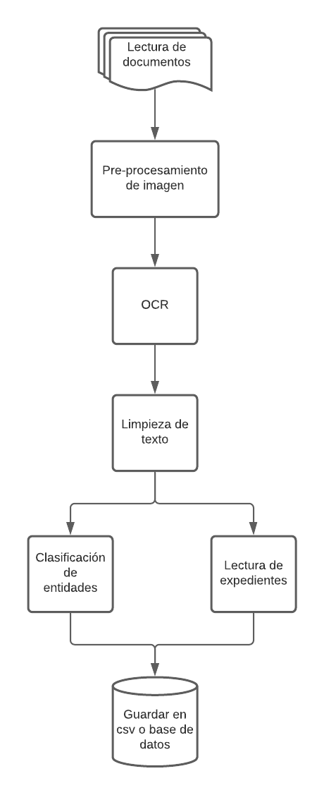

# Hackathon RIIAA 2021 "JusticIA para los desaparecidos"

# Titulo de su proyecto

**Nombre del equipo**  
`<inserte nombre>`

**Integrantes**
* Carolina Acosta
* Gerald García
* Jesús Banda
* Cuauhtémoc Bautista
* Arturo Granados

## Descripción

El objetivo de este proyecto es la creación de un multi-clasificador utilizando las fichas digitalizadas
originalmente producidas por la extinta Dirección Federal de Seguridad (**DFS**); el cual será capaz de 
clasificar el texto como: persona (víctima o funcionario), organizaciones, lugares, fechas o desconocido.
La finalidad de este clasificador es esclarecer el paradero de personas desaparecidas de manera forzada 
por el Estado Mexicano entre los años 1964 y 1985.

## Pipeline

## Cómo correr el código
Ejecutar el notebook que se encuentra en el folder `notebooks`, llamado pipeline.ipynb. 
Es recomendado utilizar [Google Colab](https://colab.research.google.com) para su ejecución.

## Notas
### Requisitos en sistema:

#### Versión python
> python 3.7.4

#### Otros:
> libleptonica-dev tesseract-ocr libtesseract-dev

## Estructura del proyecto

## Referencias
- All Binarize module was obtained from [Gallego 2019](https://github.com/ajgallego/document-image-binarization) 
- AGUAYO, Sergio, 1968. Los archivos de la violencia. México: Grijalbo, 1998.
- AGUAYO, Sergio, La charola. Una historia de los servicios de inteligencia en México. México: Grijalbo, 2001.
AGUAYO, Servio, El Cisen y la AGN, Reforma, México, 29 de abril de 2015.
- BOCCIA Paz, Alfredo et. al., En los sótanos de los generales. Los documentos ocultos del Operativo Cóndor, Asunción: Expolibro-Servilibro, 2002. 
- DA SILVA Canela Ludmila y Elizabeth Jelin (Compiladores), Los archivos de la represión: Documentos, memoria y verdad, Siglo XXI.
- GARCÍA Morales, Alfonso et. al., México. La Fiscalía Especial para Movimientos Sociales y Políticos del Pasado, en Rubén Ruiz Guerra (coord.). Entre la memoria y la justicia.
- Experiencias latinoamericanas sobre la Guerra Sucia y la defensa de Derechos Humanos. México: UNAM, 2005.
- GLOCKNER Fritz, Los años heridos. La historia de la guerrilla en Mèxico 1968 – 1985, JELIN Elizabeth, Introducción. Gestión política, gestión administrativa y gestión histórica: ocultamientos y descubrimiento de los archivos de la represión, en Jelin (2002) Jelin, Elizabeth y Ludmila Da Silva, Los archivos de la represión. Documentos memoria y verdad. Madrid: Siglo XXI, 2002.
- ORTEGA Galindo, Anuar, Sobre el parcial cierre del archivo de la DFS en el Archivo General de la Nación, en Vertical, 24 de abril de 2015, Disponible en http://verticalmex.com/sobre-el-parcial-cierre-del-archivo-de-la-dfs-en-el-archivo-general-de-la-nacion/
- PAXMAN Andrew, Crisis en el Archivo General de la Nación, en Arena Pública, 4 de abril de 2015, Disponible en http://arenapublica.com/blogs/andrew-paxman/2015/04/06/3427
- OVALLE Camilo Vicente, Tiempo suspendido. Una historia de la desaparición forzada en Mèxico, 1940 - 1980.
- PÉREZ Alfaro, María Magdalena, “Archivo, censura, memoria”, en El presente del pasado 2. 0, 16 de abril de 2015, Disponible en http://elpresentedelpasado.com/2015/04/16/archivo-censura-memoria/
- VERDUZCO Carolina e Ileana Chávez, Informe histórico presentado a la Sociedad Mexicana: fiscalía especial FEMOSPP. México: Comité 68 Pro-Libertades Democráticas, 2008.
- VICENTE Ovalle, Camilo, Archivo: entre historia, democracia e impunidad, 29 de abril de 2015, Disponible en http://camilovicente.com/wp-content/uploads/2015/05/Archivo_entre-_historia_democracia_impunidad.pdf
